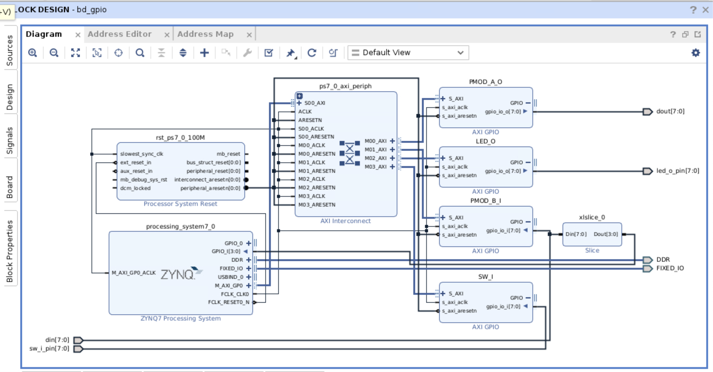
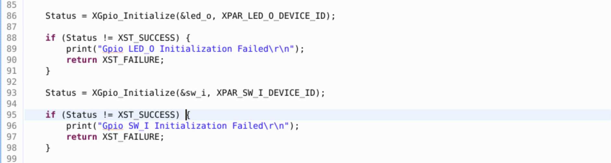
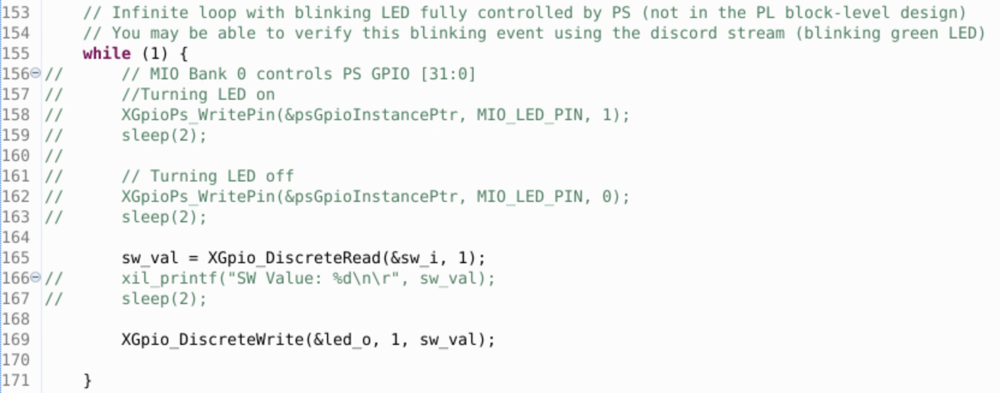
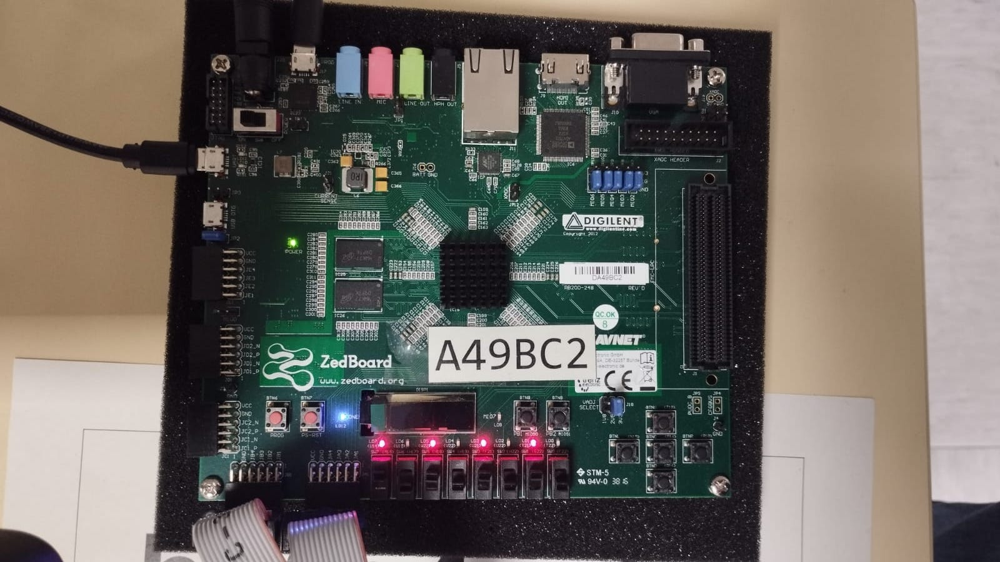

# Zynq and ZedBoard

Take care with the USB connectors

Depending of the jumpers are connected, the boot could be done by JTAG, QUAD-SPI flash memory or SD Memory card

SRAM (Synchronous RAM)

FPGA never save the bitstream inside their memory, has not flash memory inside, to make a persistence in the bitstream, it is necessary to sen the bitstream to the QUAD-SPI flash memory in order to the FPGA load this bitstream every time it turned on

Single ended and differential:
LVDS, electrical standard for input and output integrate circuits, it works mainly in high frequencies

Some time before the strategy was to transmit information through parallel interface, the problem is the noise inducted in the communication, but it was changed for a serial interface call LVDS where the signals switching between them, making a better noise rejection, the problem is they need to increase the frequency of the signals, this kind of configuration are call differential pairs.

PLL Phase Lock Loop, provide an interface to multiply an input frequency.

The input clock are provide for an external crystal, it feeds the PS and PL sides both.

---

### Differences between C and Embedded C

The capabilities of the processor systems are the most important constrain.

Code speed and code size

C for embedded systems use a particular compiler for ARM processors, it is build for a particular target and processors, it is different for Texas Instruments and microchip and others.

Some advantages:

It is small and reasonable simple to learn.
C has advantages in processor independence and is nor specific for any particular microprocessor

---

## C concepts

Basic types

- local variables and global variables:

Local are only accessed by the function itself, global are available on all the program, has a high memory consumption.

Static modifier makes the global variables works as local in a specific file, you can to use ‘static int flag’ in different files and the variable can to have different values on these files.

Volatile implies that the variable can be changed outside to the program, probably by the hardware, if not volatile and there is a condition dependen of a variable that not change in the program, the compiler optimize and delete the conditional, but with volatile it will not optimized.

Use of pointers:
Pointer correspond to a MEMORY ADDRESS

---

### GPIO set data direction

```c
void XGpio_SetDataDirection(XGpio *InstancePtr, unsigned Channel, u32 DirectionMask);
```

to read a pin value

```c
u32 XGpio_DiscreteRead(XGpio *InstancePtr, unsigned Channel);
```

and similar to write

when you include an IPCore in vivado, it willbe include in Vitis in the C Code

```c
#include "xspi.h"  /* SPI device driver */
```

it is important to know how to build your own custom IP. custom IP allow us to implement an IPCore that can be to imported into the Vivado environment.

AXI bus assigns a custom address to the specific IP Core.

It is possible to define macros as well

```c
#define LED_IP_mWriteReg(BaseAddress, RegOffset, Data) Xil_Out32((BaseAddress) + (RegOffset), (Xuint32)(Data))
```


- When you create a custom IP< you need to load the specific IP Address in Vitis before use it.

---

# Introduction to AXI-Custom IP

how to interconnect the different components of the design.

BUS specification have differents forms, one of the first was the `PLBv46`, now it is called `AXI`, other noo to much commont is `WishBone`, 

| Interface       | Features                                                             | Burst     | Data Width      | Application                     |
| --------------- | -------------------------------------------------------------------- | --------- | --------------- | ------------------------------- |
| `AXI4`        | Traditional Address/Data Burst<br />(Single address, multiple data)  | Up to 256 | 32 to 1024 bits | Embedded,<br />Memory           |
| `AXI4-Stream` | Data-Only, Burst                                                     | Unlimited | Any number      | DSP, Video,<br />Communications |
| `AXI4-Lite`   | Traditional Address/Data-No Burst (Single<br />address, single data) | 1         | 32 or 64 bits   | Small Control<br />Logic, FSM   |

Vivado provides a tool call `ILS` (Internal Logic Scope) or `ILA` (Internal Logic Analyzer) to debug `AXI` communication.

---

### Custom AXI IPs

When you need block in your Vivado environment that is not provided for Vivado, you need to create your custom IP.

Vendors cand provide some types of IPCores, some of them provide VHDL code, not allowed to re-sell, and modifications are not supported by vendors, also can provide encrypted HDL, works as a black box where you configure with some parameters, and Gate-Level Netlist.

To connect an IP with AXI we need to create an Wrapper to make the connection.


there is a problem with Makefile and using Custom IP core, some of the solutions are provided in [Link 1](https://support.xilinx.com/s/article/75527?language=en_US) or [Link 2](https://support.xilinx.com/s/question/0D52E00006hpRo8SAE/vitis-20211-error-makefile?language=en_US), but also I provide a solution in my [Repository](https://github.com/PhysicsUdeA/GICM_Xilinx_Tutorial).

Use this Makefile prototype

```makefile
COMPILER=
ARCHIVER=
CP=cp
COMPILER_FLAGS=
EXTRA_COMPILER_FLAGS=
LIB=libxil.a

RELEASEDIR=../../../lib
INCLUDEDIR=../../../include
INCLUDES=-I./. -I${INCLUDEDIR}

INCLUDEFILES=$(wildcard *.h)
LIBSOURCES=$(wildcard *.c *.cpp)
OUTS =*.o
OBJECTS = $(addsuffix .o, $(basename $(wildcard *.c *.cpp)))
ASSEMBLY_OBJECTS = $(addsuffix .o, $(basename $(wildcard *.S)))

libs:
	echo "Compiling myip_led_ctrl..."
	$(COMPILER) $(COMPILER_FLAGS) $(EXTRA_COMPILER_FLAGS) $(INCLUDES) $(LIBSOURCES)
	$(ARCHIVER) -r ${RELEASEDIR}/${LIB} ${OBJECTS} ${ASSEMBLY_OBJECTS}
	make clean

include:
	${CP} $(INCLUDEFILES) $(INCLUDEDIR)

clean:
	rm -rf ${OBJECTS} ${ASSEMBLY_OBJECTS}
```

---

**SOLUTION**

This issue is related to the Makefile used in the driver output directory, whether it was created manually, or by the tools.

Compare your Makefile to the highlighted sections in the example Makefile below. This issue is planned to be addressed in a future release.

Original:

```makefile
INCLUDEFILES=*.h
LIBSOURCES=*.c
OUTS = *.o

libs:
echo "Compiling myip"
$(COMPILER) $(COMPILER_FLAGS) $(EXTRA_COMPILER_FLAGS) $(INCLUDES) $(LIBSOURCES)
$(ARCHIVER) -r ${RELEASEDIR}/${LIB} $(OUTS)
make clean

include:
${CP} $(INCLUDEFILES) $(INCLUDEDIR)

clean:
rm -rf ${OUTS}
```

This issue is due to the OUTS = *.o definition. In the latest mingw toolchains, using *.o will not work. The Makefile will need to be updated to use wildcards as in the below example:

```makefile
INCLUDEFILES=*.h
LIBSOURCES=*.c
OUTS = *.o
OBJECTS = $(addsuffix .o, $(basename $(wildcard *.c)))
ASSEMBLY_OBJECTS = $(addsuffix .o, $(basename $(wildcard *.S)))

libs:
echo "Compiling myip"
$(COMPILER) $(COMPILER_FLAGS) $(EXTRA_COMPILER_FLAGS) $(INCLUDES) $(LIBSOURCES)
$(ARCHIVER) -r ${RELEASEDIR}/${LIB} ${OBJECTS} ${ASSEMBLY_OBJECTS}
make clean

include:
${CP} $(INCLUDEFILES) $(INCLUDEDIR)

clean:
rm -rf ${OBJECTS} ${ASSEMBLY_OBJECTS}
```

**Method 1:** Modify your custom exported IP drivers folder to modify the Makefile as above. Then add the IP to your user repository and include it in your Vivado project, then export the XSA via write_hw_platform or** ** **File > Export > Export Hardware** . Be sure to check that the output XSA content (the drivers folder and updated Makefile) is correct.

**Method 2:** If the driver is added as part of an existing XSA file, then you can extract the Makefile from the XSA or open the XSA as an archive and edit the Makefile manually, then re-insert it into the XSA. Once edited, be sure to Update the HW Specification on your Platform project (right-click on your platform project in the Explorer view) or create a new Platform project in Vitis with the modified XSA and modify your application to use the new platform.

**Method 3:** Create the folder hierarchy below, and place the driver into the drivers folder:
repo\XilinxProcessorIPLib\drivers
Then in Vitis, select** ** **Tools > Repository** . Select New, and point to the repo folder.

**Note:** the two levels are needed.

Then if you re-create your domain, the driver in the repo should be used instead of the one in the XSA.


# Laboratory 1 Solution

Implementation in Vivado, Block diagram with IPCores.



Modifications in code





Solution of the laboratory



### Performance results

| Method         | text  | data | bss   | dec   | hex   |
| -------------- | ----- | ---- | ----- | ----- | ----- |
| `xil_printf` | 27021 | 1184 | 22616 | 50821 | C685  |
| `printf`     | 55091 | 2588 | 22680 | 80359 | 139E7 |
| `print`      | 25981 | 1184 | 22616 | 49781 | C275  |

---
