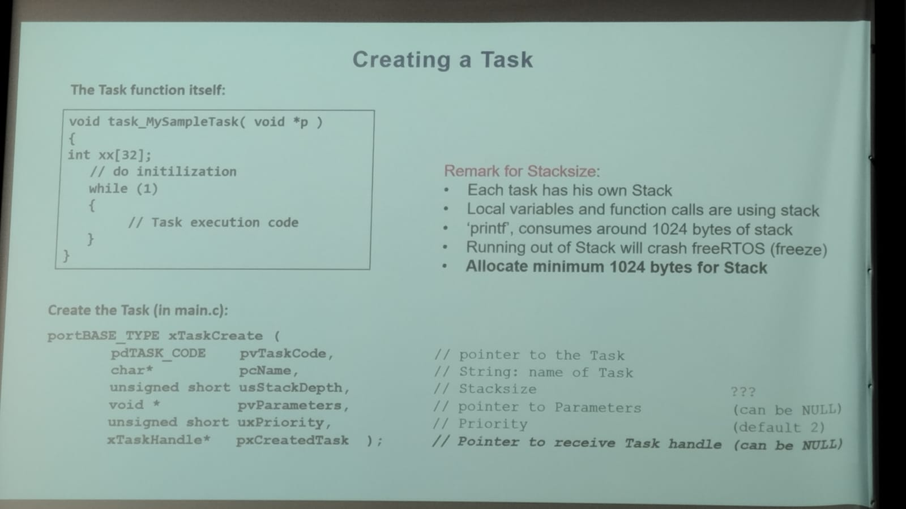

# The importance of Reconfigurable Hardware in Virtualized Communication Network

author: luca.valcarenghi@santannapisa.it

The problem of have hardware accelerator and processor is to communicate the data beetween them, is to transport and synchronize the data to obtain the desire performance.

Data transfer impact the Virtualized Network Function (VNF) 

Acceleration can impruve the performance of the network, but consider the issues in the data transfer. If you have the possibility to access to the memory very quickly, faster you can to make the data processing.

The virtualization begins with virtual machines

Use of Smart Network Interface Cards (Smart NIC), to improve the performance of physical layers.


There is limitations between the quantity of data received through the communication bus and the quantity of data to be processed.

The pipeline is: Hardware acceleration -> performance -> Data packing -> Data sharing and processing.

**OFDM**, is a technique of modulation in frequency to send data.

The CPU usually is more energy hungry than the FPGA, that is other advantage of the reconfigurable hardware.

#### Performance meaurements

- Speed of processing


GPU shows the best performance, but an interesting think is the stability of the FPGA performance don't matter the size of the data to be process, , CPU only are better since the number of cores increases.

- Energy usage


GPU has more power comsumption, but the FPGA has better stability an lower comsumption.

---

# Operating Systems on ZYNQ

author: Heinrich Bartholomaus RONGEN

### FreeRTOS and others

use of LwIP and FatFS

There is a Gap historically in the implementation of embedded systems, microcontrollers are so much small in capacity and memory, usually was used **Baremetal** programming, instead of PC that can use a lot of resources and can to use too **Operative Systems**.

What are your software application requirements

Real Time performance <--------------------------------------------------------> High System performance


#### ZYNQ OS support

Zynq-7000 support a lot of systems

- Open Source Linux
- Open Source Android
- Open Source FreeRTOS
  - Light-weight real-time OS

**[Operating Systems](https://www.freertos.org) <-> [Ethernet TCP/IP](https://lwip.wikia.com/wiki/LwIP_Wiki) <-> [Filesystem](http://elm-chan.org/fsw/ff/00index_e.html)**

FreeRTOS born in 2003 and initially conceived for microcontrollers

- Really light
- simple: just 3 C code files to run

It is included for *Xilinx*.

is provide as a BSP

the connection is:

Device drivers <-> FreeRTOS <-> LwIP <-> Application

#### Example program - STANDALONE

```c
void main(){
    Init_all();
    while(1) {
        instructions();
    }
}
```


#### Example program - FreeRTOS

```c
void main(){
    xTaskCreate(Task_A, ...);
    xTaskCreate(Task_B, ...);
    xTaskCreate(Task_C, ...);
    xTaskStartScheduler();
}

/* Task A Definition, same structure for B ands C*/
void Task_A(void *p){
    Init_A();
    while(1){
        do_A();
    }
}
```


A Task is a parallel operating main, every task looks like a main function, has some parameters


It is possible to suspend a task

### Example of a simple execution


#### Creation of the task



For now, it is not possible to interact with the Scheduller, one way is modify the priority assigned to the task but it is not possible to configurate the Scheduller in to many ways for now. you need to enter to the definition and it can be very tricky and hard.

##### Some FreeRTOS functions

| Functions                  | Description                       |
| -------------------------- | --------------------------------- |
| `xTaskCreate(...)`       | Create a task                     |
| `xTaskStartScheduller()` | Start the scheduller              |
| `vTaskDelay(...)`        | Make a delay on time              |
| `vTaskDelayUntil(...)`   | Make a delay until some condition |
| `vTaskDelete(...)`       | Delete a task                     |
| `xQueueSend(...)`        | Send data to Queue                |
| `xQueueReceive(...)`     | Receive data from Queue           |
| `xSemaphoreTake(...)`    | Takes the semaphore token         |
