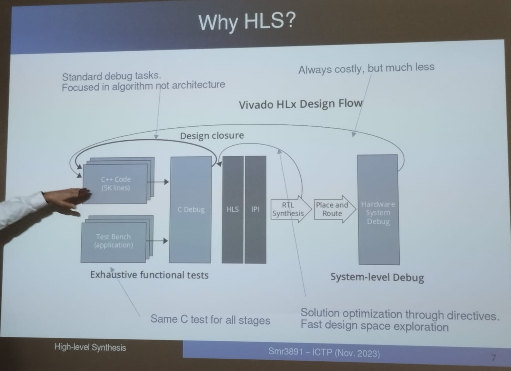
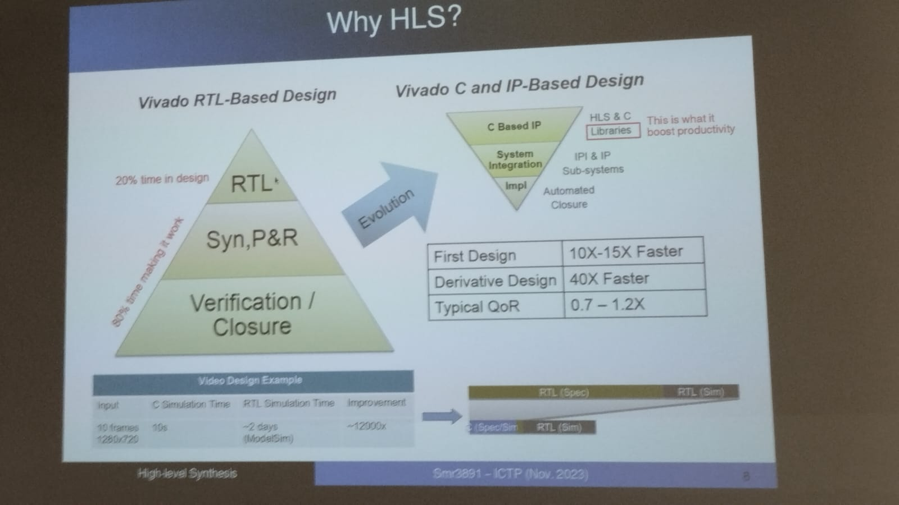
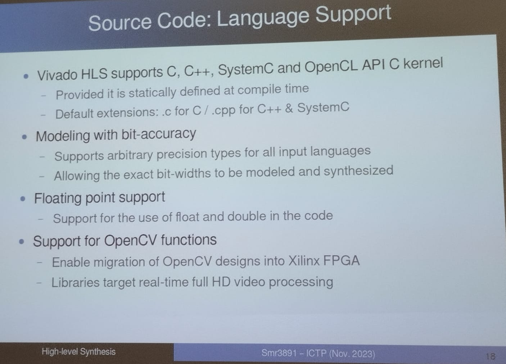
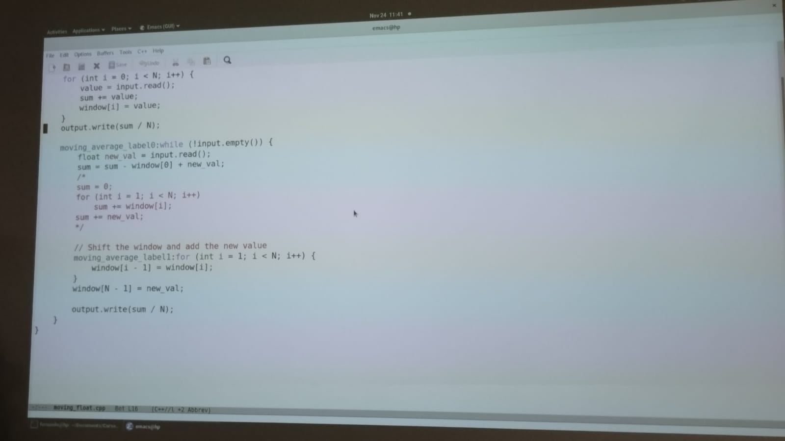

# RISC-V Models

A starting point (BeagleBoard).

**RISC-V** es una arquitectura de conjunto de instrucciones (ISA) de hardware libre basado en un diseño de tipo RISC (conjunto de instrucciones reducido).

### Tipos de Licencia


---

# High-Level Synthesis (HLS)

When you work in the reconfigurable hardware design usually use VHDL to describe the hardware, but with HLS you can to use something like `c` code to generate the hardware description.

From this it is possible to export a RTL design.

Let's design a FIR filter:

- Data types and structures can be generalized up to a certain point, operation are assumed to be solve in one clock cycle, I/O einterface should later ne wrapped for the appropiated BUS

In most of the times it is not the most efficient way to design. you need to think in a lot of specific details to design:

- Design VHDL code
- majke RTL simulation, and correct errors
- Make a synthesis
- Make a route
- Make a hardware design debug

but, what if not meeting clock cycle.

The idea is try to reuse the designs for another applications.

##### Compilation of behavioral algortims into RTL description

**Input**:

- *Behavioral description*
  - Algoritm
- *Constrains*
  - I O description
  - Timing
  - Memory
- *High level Synthesis*
  - Microarchitecture evaluation
  - FSM extraction
  - Operations and datapath extraction
  - Interface synthesis

**Output**

- **RTL IP**

Now using HLS



`C` code is easier to compose, also you now do not need to make a simulation of the synthesis, now you can to do a Debug, the verification can be done in `C` code too.

you can use `pragma` codes, `interruption` and `define` to create your synthesized hardware.

Other possibility is that you can to use the code in other projects.

### Paradigm change



One of the mos important changes is the stage where you need to put more effort, usually in VHDL design you compsuption in time is more in the Verification of the hardware, in this new paradigm the most important effort is concentrate in the C code design, this also imply that the productivity is better.

#### Some examples

the schedule of the sequential operations is very important, it defines if the operation can be done in parallel or not and has considerable effect in the syntetization of the hardware.

### Source Code and Language support



## Architecture of HLS code

Only one top lever function is allowed

**Functions**: Represent the design hierarchy

**Top level IO**: Top level arguments determine Interface ports

**Types**: Type influences area and performance

**Loops**: Their scheduling has major impact on area and performance

**Array**: Mapped into memory, may become main performance bottlenecks

**Operators**: Can be shared or replicated to meet performance

```c
void fir (data_t *y, coef_t c[4], data_t x)
{
    static data_t shift_reg[4];
    acc_t acc;
    int i;

    acc = 0;
    loop: for (i=3;i>=0;i--)
    {
        if (i==0)
        {
            acc += x*c[0];
            shift_reg[0] = x;  
        } else {
            shift_reg[i] = shift_reg[i-1];  
            acc += shift_reg[i] * c[i];
        }
    }
    *y = acc;
}
```

You need to avoid the dependencies, because this reduce the possibility of parallelization:



In the previous code, the `sum` uncommented part is neede for the processor, without this the code does not run in the processor, but for HLS, the comment part is neccesary because it eliminates the dependency of prevous iterations and can make a parallel synthesis, the local loop, internal loop reduce the dependency of previous iterations. **It is something to have in mind when you are designing HLS hardware**.
