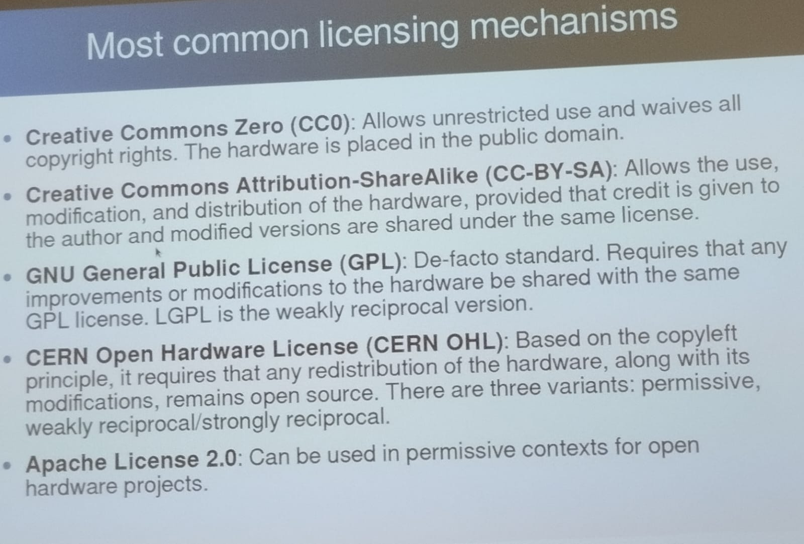

# RISC-V Models

A starting point (BeagleBoard).

**RISC-V** es una arquitectura de conjunto de instrucciones (ISA) de hardware libre basado en un diseño de tipo RISC (conjunto de instrucciones reducido).

### Tipos de Licencia

---
