# Development in X-RAY spectrography

Author: Kalliopi KANAKI (IAEA, Austria)

#### XRD analysis through difractogram

the provide repsponses in different frequency bands and allows to identify the comopsition of a sample.

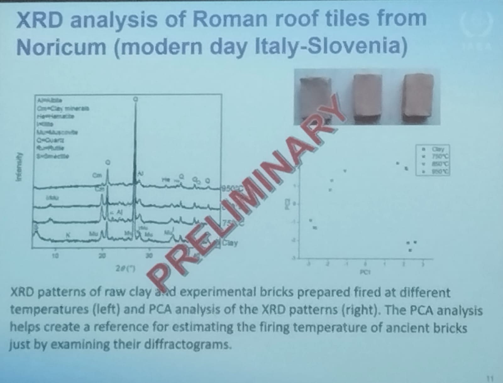

### Access to accelerator facilities

They have soome facilities to make this kind of analysis

They have Neutron generators

Water bricks works as a shirld for the neutrons,

The protocol is quick strict, you need to do some simulations to evaluate the quantity of radiation, and to convince the authorities about the security of the study before to make the study.

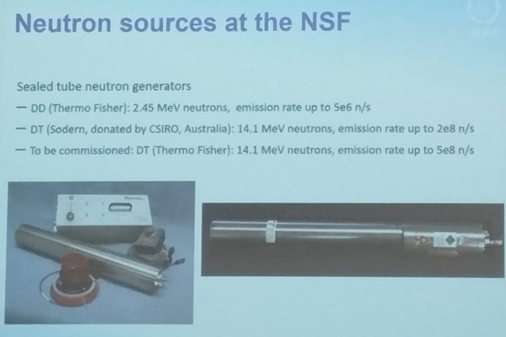

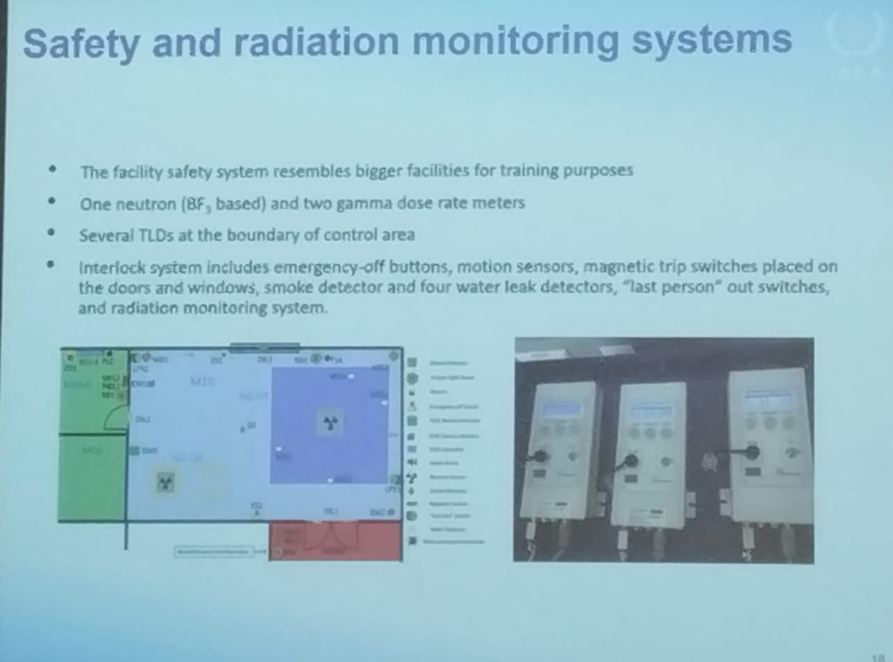

### Facilities are open for people

The facilities are available for classification of Gammas and neutrons.

They have Muclear Instrumentation in-Situ. it means you have a stationary device to do the measurements but you can to transport this to do analysis in other places.

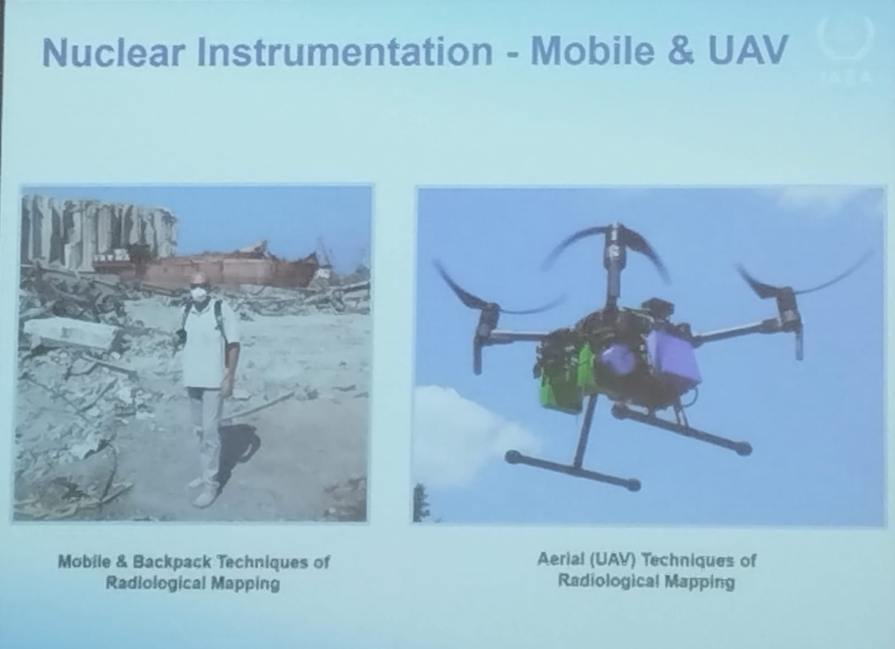

the drone flys two times

1. Used to make a geometrical reconstruction of the area of analysis.
2. Used to make the Gamma ray spectrometry of this site.

They also work in Neutrino detection.

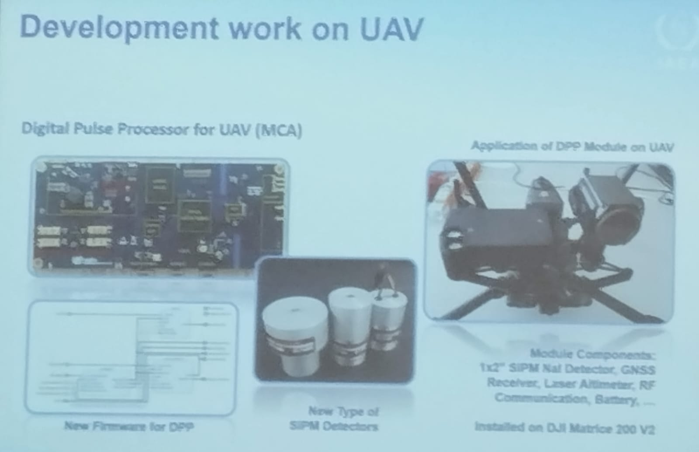

These are the facilities of the laboratory.

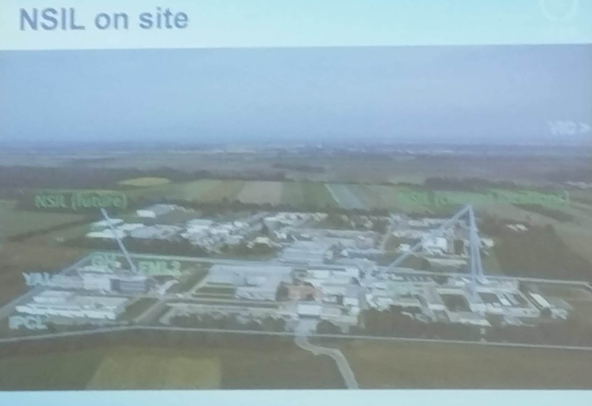

#### Modes of collaboration/interaction with the IAEA

**Contract types**

- Internship (3-12 months), non-extendable, not repeatable.
- IAEA Marie Sklodowska Curie fellowship (3-12 months)
- Fellowships (via Technical Cooperation Department)
- PhD Consultancies and full consultancies
  - Home based assigments
  - Expert missions

**Event types**

- Technical meetings
- Training events
- Consultancy meetings

**Formal Collaboration Types**

- Practical arrangements
- MoU
- Collaboration agreements
- Collaboration centres

---

# Machine Learning on FPGA

Machine learning and model compresion techniques

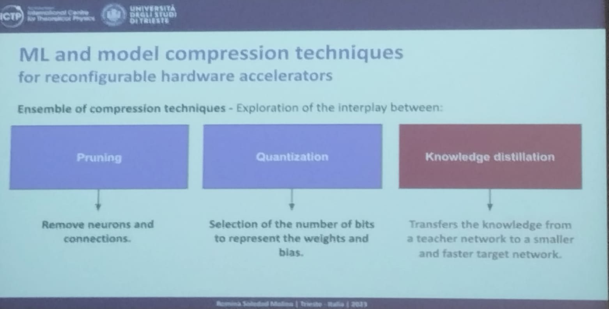

#### Workflow to compress the model

- DNN Training and compression
  - Dataset --> DNN Model <--> Compression

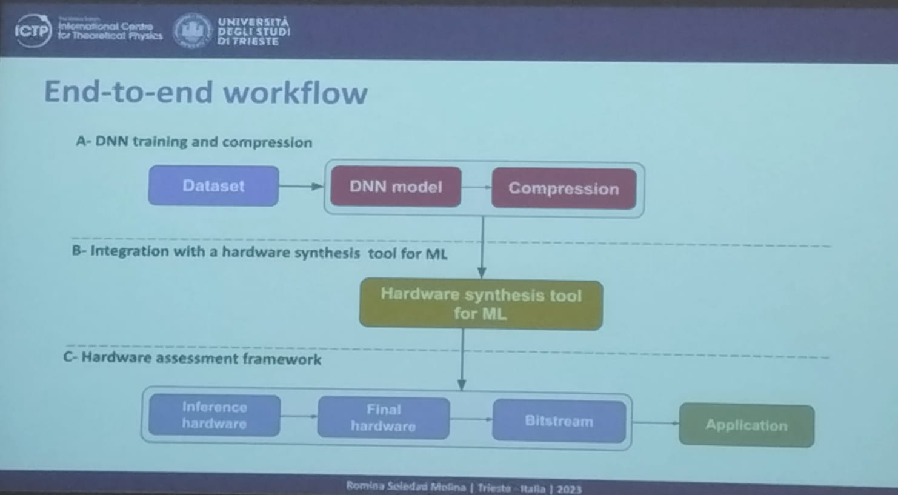

##### DNN Training and compression

1. Obtain the dataset ands create the model
2. Define the architecture
3. How I'll design the architecture, how many neurons,

Stage 2. Student training

- Involve the definition of architecture, how many bits has the data of each layer.

There are two model, big one is from teachers and small one is for Student, it is important for the definition of the hyperparameters.

all these steps are just for training

## Integration with a hardware synthesis tool for Machine Learning

Once we have the model in `TensorFlow`, wee need to do the translation, we can to use HLS for Machine Learning.

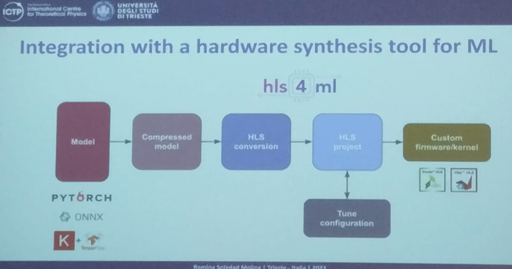

### High-Level Synthesis for Machine Learning (HLS 4 ML)

**ML framework support**:

- Keras
- PyTorch (limited)
- ONNX (in development)

**Neural Network architectures**:

- Fully connected NN
- Convolutional NN
- Recurrent NN
- Graph NN

**HLS Backends**:

- Vivado HLS
- Intel HLS
- Vitis HLS (Experimental)

### Hardware assessment network

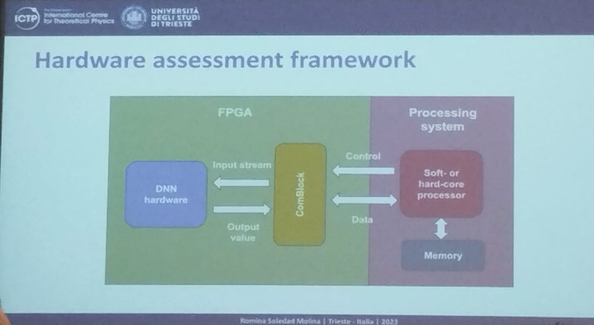

### Pulse shape discriminator

The aim is to distinguish different types of pulses of cosmological events

Teacher architecture is like the trained architecture to maximace performance in classification, reduce architecture is to use the minimum structure that can be implemented in the FPGA but with a similar performance in classification.

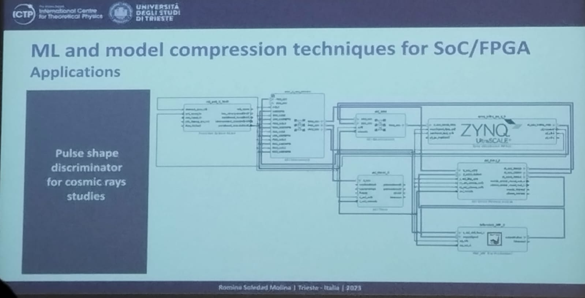

It also can be implemented in systems like **PYNQ**, **KRIA** and **ZedBoard**.

##### Final Remarks

- The proposed workflow generates compressed models, leading to th efully chip integration
- The integration of KD contributes to achieve the balance in the use of resources into the SOC.
- It contributes in the development of a fully ML architecture deployment.
- The `ComBlock` allows the access to the communication easily.

---

# Gaining a Deeper Insight Into tje Project Lab Setuop

## System and Hardware Perspective

Author: Nikola Jovalekic

THe preparation of a experimental setup for particles detection needs to consider a lot of parts inside the design. Between them it is important to consider the acquisition, preamplification, conditioning, and all the analogic chain to prepare the data, after that, the constrains in the acquisition part related with speed of acquisition, the voltage resolution. Also the basis configuration of the SoC as for example the voltage sources and the clock sources.

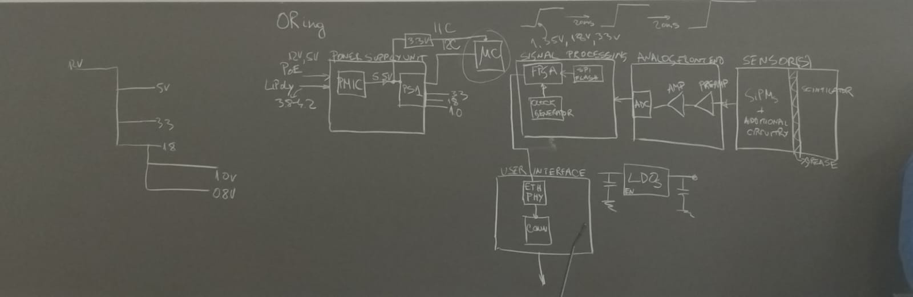

It is important to consider the environment where the system will operate, it is not the same the requirements for a laboratory environment, where some of the conditions are controlled, instead of a outside environment where there are a lot of variables out of control, for example the power source need to be considered and designed different for both environments.

It is different the power sourcing for analog and digital side, digital can be powered with Switched regulators, but in Analog Front End it is recomended to use Low Drop Out regulators, their are linear regulators an reduce the ripple noise in the analog chain.

### Detector setup architecture

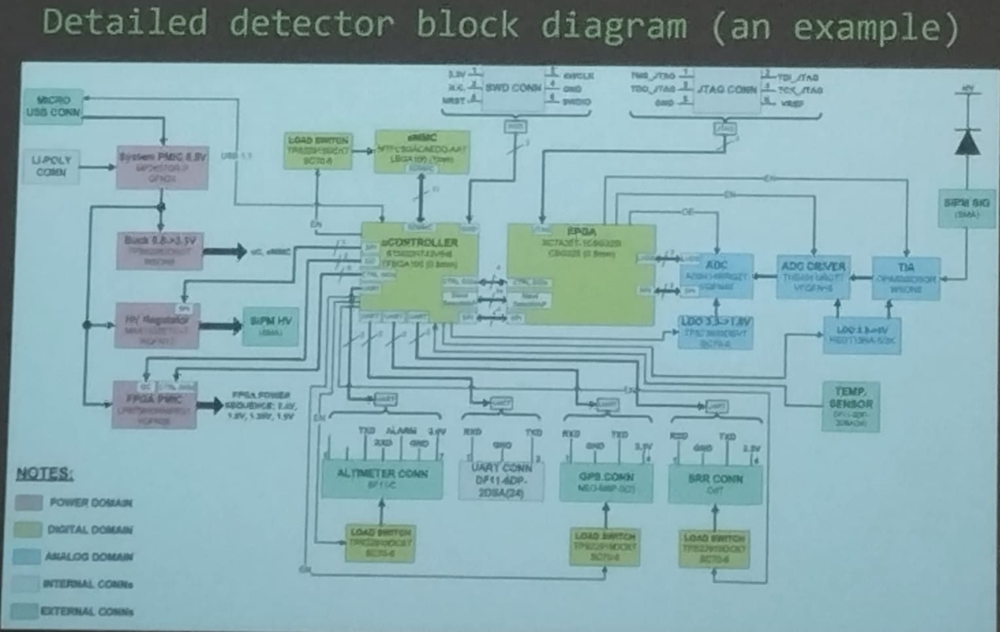

### How do we come to the physical device starting from detailed block diagram

- Component selection based on requirements specification
- Inspection of the design files shared by component manufacturer
- Analysis of the power consumption of the key components
- Drafting power supplies tree.
- Finding simulation models for the power supply ICs and performing design verification

##### Deveopment of these steps

- Read a lot of datasheets.
- Design libraries of components to map the peripherals, both parts the schematic view and the footprint.

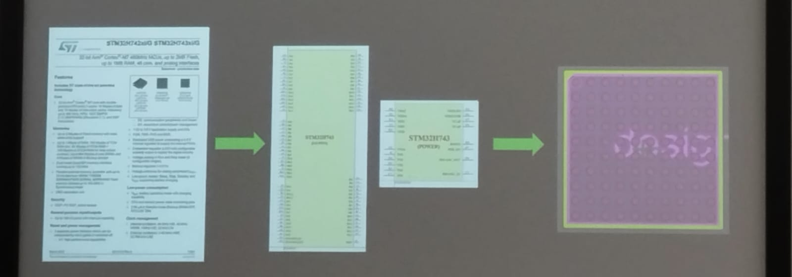

- Design the complete schematic of the system.

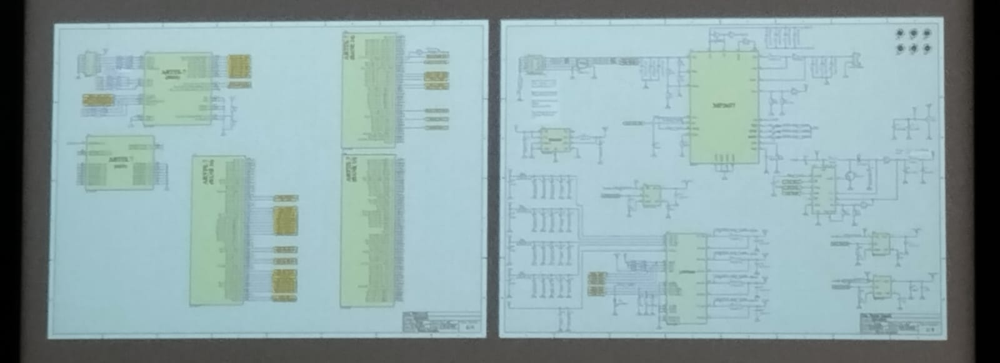

- After all the verifications and when you think everything os good, you can to jump to the physical world.

  

In the design and routing of LVDS you need control impedance to reduce the ripple and the signal bounces to `100 ohms`. Also you need to control the crosstalk. the propagation of capacitive effect between differential pairs.

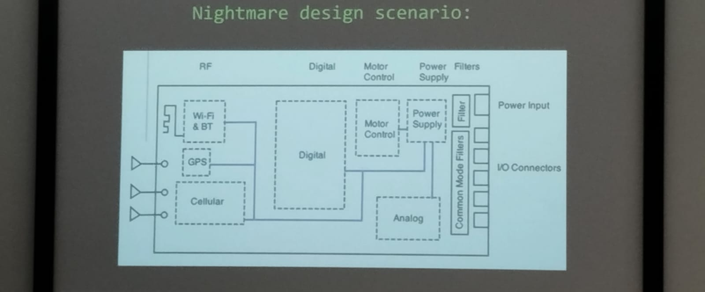

- Production files encompass gerber files, NC drill file, and stackuo information.

### Design errors and common mistakes

- Failure to do Design for Logistic (DfL)
- Failure to do Design for Manufacturability (DfM)
- Failure to do Design for Testability (DfT)
- Failure to do Design for Electromagnetic Compatibilityn(DfEMC)

---
