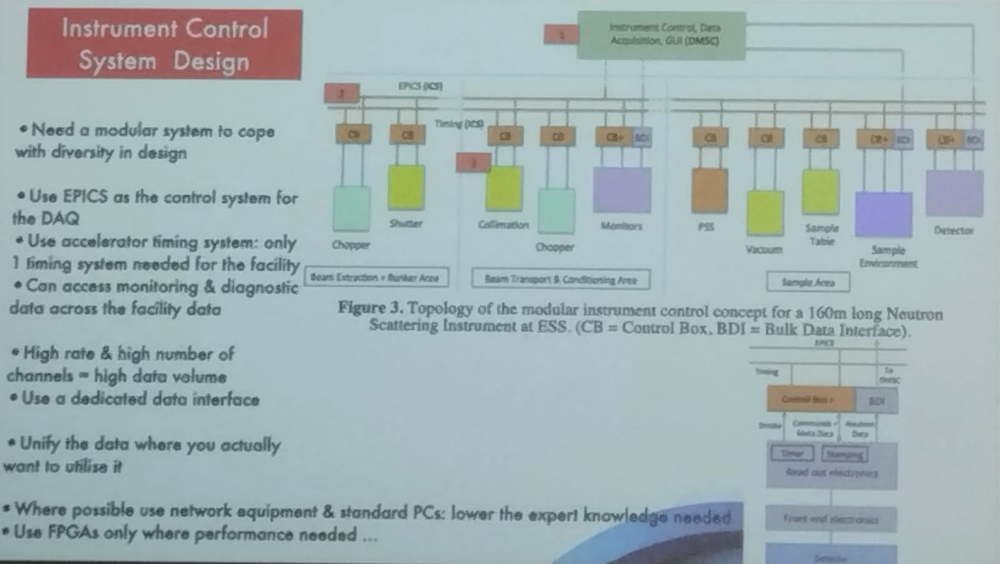

# The European Spallation Source Data Acquisition

Author: Richard HALL-WILTON

Spallation facilities has one of the biggest Neutrino ray in the world.

Measurement of the cross section and the probability to measure the Neutrino from the beam.

The target is located in the center of the experiment, and the neutrino bean is accelerate to this. Also they mentioned the use of Proton beam.

About the sensor:

**Typical detector requirements**:

- Size from 0.25m^2 up to 30m^2
- Position resoluton 100um - 10mm
- Time resolution <1us
- Rate and DAQ requirements very much defined by the instrument and data topology
- Can be >MHz/channel instantaneous in some cases
- Average rates much lower
- Every instrument is very much a bespoke individual design
- For a good user experience
  - it is important to design the detector to the individual detector
  - It is important to make sure that the DAQ can cope with the and has a homogeneous look and feel.

### Structure of a Detector

