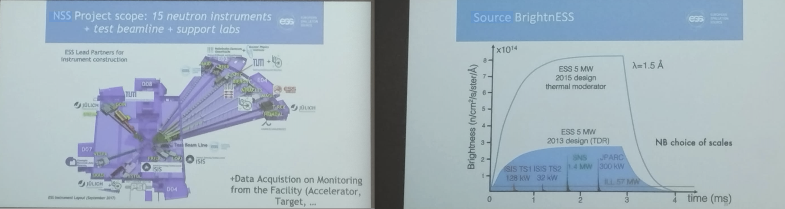
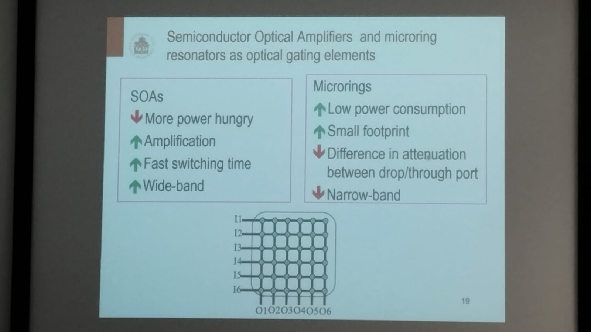

# The European Spallation Source Data Acquisition

Author: Richard HALL-WILTON

Spallation facilities has one of the biggest Neutrino ray in the world.

Measurement of the cross section and the probability to measure the Neutrino from the beam.

The target is located in the center of the experiment, and the neutrino bean is accelerate to this. Also they mentioned the use of Proton beam.

About the sensor:

**Typical detector requirements**:

- Size from 0.25m^2 up to 30m^2
- Position resoluton 100um - 10mm
- Time resolution <1us
- Rate and DAQ requirements very much defined by the instrument and data topology
- Can be >MHz/channel instantaneous in some cases
- Average rates much lower
- Every instrument is very much a bespoke individual design
- For a good user experience
  - it is important to design the detector to the individual detector
  - It is important to make sure that the DAQ can cope with the and has a homogeneous look and feel.

### Structure of a Detector

### Pipeline

- **Data acquisition**
- **Calculation**: Based on previous experiments, previous observations, model building
- Simulation
- Prototype

## Some Spectral techniques

It is how a final data processed is looked

## Data Acquisition Chain

The integration of the DAQ for the instruments is done at hte backend readout electronics

How the Readout electronics is configurate?

**VMM3A** is equivalent to the **VFAT**, also can to works with GEMs.

#### Some final thought

- Development time is long, takes around 10 years to have data
- All the proposal project begins in 1950 and is spected that works fully in 2030.
- It is necessary to do collaboration with other institutions to build the different stages of the experiment.

## Summary

---

# Switch architectures for Data Center networks

Author: Piero CASTOLDI

Director of Scoula Superiore Sant'Anna in Pissa. FPhotonics and integrated circuits.

> Instituto comprises telecommunications, working in different segments of tlecom, 5g, mobile, Also cyberphysical systems. Artificial Intelligence, Robotics, Photonics as the evolution of electronics, based on the transport of photons.
>
> They have a PhD program in photonics, and they are open for applications.

## Data Center Architectures

Server racks in Google DC

Classical architecture is made as blades, now there is a hierarchical architecture

- THe interconnection is made by switchs

The two times redundancy is applyed to the architecture

- Distributed architecture:

#### Difference between electronics and photonics

Photonics allows high speed but not memory, you can not store information in photonics domain.

Other difference is that the time domain is possible both in electronics and photonics, but wavelength domain are also available in both but in electronics with a lot of limitations.

In communication architecture is necessary to do switch between electronics and photonics, photonics is so usefull for high speed information transmition, but still it is necessary electronics to make a information storage and persistance.

**Interesting topic: Photonics in circuit**

### Types of architectures

##### Typical scheme to transform from pohotonics to electronics

In this when there is a photon in the photodiode, this produce a current thart moves through the resistor and produce a voltage drop in the circuit, this can be interpretate as a input signal as well.

#### Other architecture

There is a central wave guide in a microscale, also there are microrings that can transfer the optical power into the ring. other part is to change the temperature inside. the ring works to couple of decouple.

They reconfigurates itself to move data from source to a sink in different space directions.

The synchronization and the transport is managed by a scheduler algoritm. there are a lot of these units in the system.

---

# Micro- and Nano- Fabrication and Quantum Technology

Author: Richard HALL-WILTON

## Data Acquisition Systems

Scalability: the Moore's Law.

The industry of microchips production begins to have an important role in the world.

https://youtu.be/MGxjOQsIs9k?si=H4YKMXYfkhDRL70V

> **Ubiquitous Sensors**: They are in our everyday devices as for example the SmartPhones.

### FBK Sensors and device centre

Locate between Austria and Switzerland border.

**Profile**: Fondazione Bruno Kessler (FBK)

#### Sensor and Devices Centre

**Sensors**: A device that is used to record that something is present or that there are changes in something

**Devices**: An object or machine that has been invented for a particular purpose, an electronic device.

> *Capabilities are only limited by creativity*

They contribute on:

- Quantum technology
- Space industry
- Industry
- Training

They are specialized on Integrated optics, SiPM, MEMS.

## FrontEnd Data Acquisition

## Quantum Technology

Why should you care?

- TRL 1-4 is not the primary concern for society
- 2nd quantum revolution will change everything (but not clear when)
- Being informed and aware is the first step in preparation
- Quantum computing will break current digital security (not clear when)
- Being ready and migrating protocols essential
- Quantum communication field is therefore relevant and important
- Quantum sensing can transform sensitivity
- Quantum imaging can transform imaging capabilities

**EPIQUS-QT** Simultaion platform: It is a quantum simulation platform on a chip.

---

# Project part 2

### Detector resolution

Resolution is full width and half maximum

Why detector resolution is important?

Allow make the quantitative analysis of the radioactivity of the sample.

In X-Ray fluorecense.

Gamma rays are originate from nlucleo

In sillicon material, $110 eV$ is the maximum energy, but for germanium the energy is lower.

One of the noise sources are the FET inside the detectors and DAQ electronics.

Capacitance of the detector depends of the geometry also.

Capacitance of detector plus capacitance of wires and cables.

The $ENC^2$ equation allows to know the total capacitance, and the different contributions to the noise.

> **Trapezoidal shaper** collect time of the event
>
> **SemiGaussian shaper** is other popular shaper nowaday

In nuclear detection is is usual to work in time domain.

It is common to use **Silicon Drift Detector**

Your custom shaper can to keeping time where the noise is minimum, they provide the information of the system, also it do not affect the speed of the measurement. Trapezoidal shaper keep the event time.

The Flicker noise is no important, has not too much influence in the information.

### The Shaper

