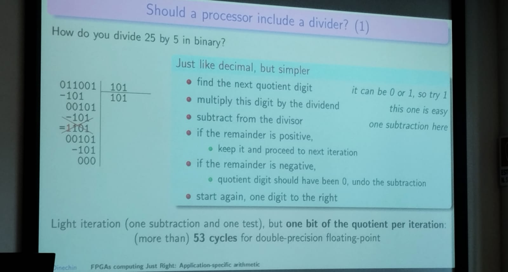
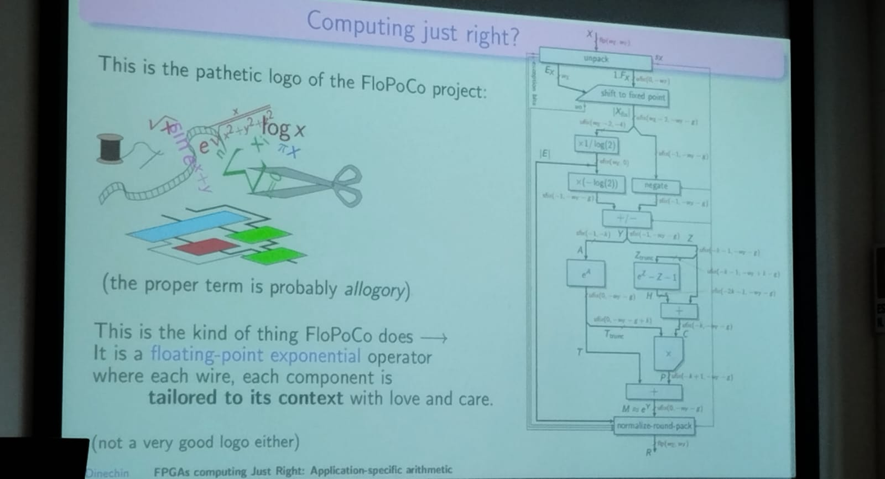
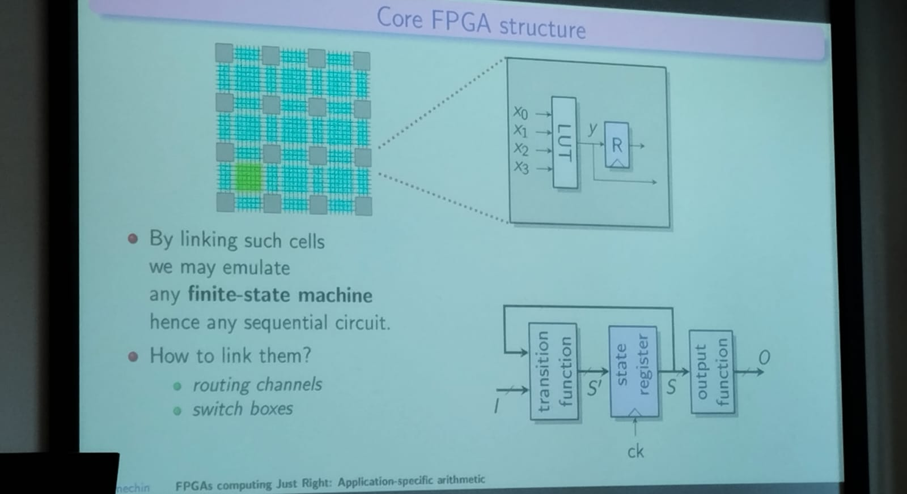
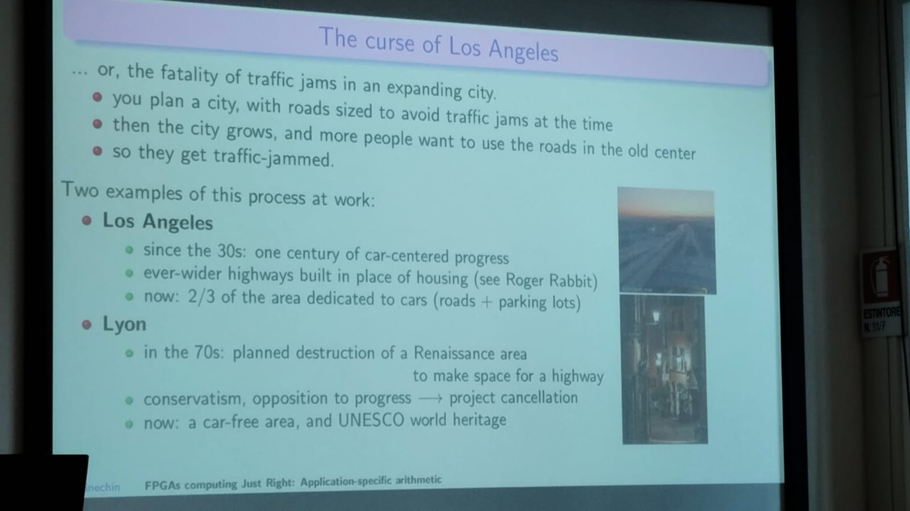
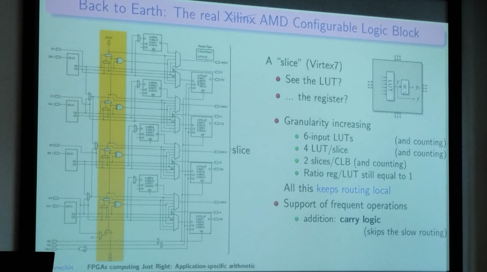

# FPGAs Computing Just Right Application-Specific Arithmetic

Author: Florent de Dinechin

Book: Application-Specific Arithmetic - Springer

### Anti-Introduction

General purpose proocessors and GPU

Should a procesosoor include:

- divider or square root
- elementray functions (exp, log, sine, cosine)
- decimal hardware
- 8-bit tensor multiplier
- ...

hoow to divide 25 by 5 in binary?

This division is simple but need a lot of iterations, thats why it is important to implement this on hardware. And with the root is the same process

> Should the processor include divider?: **YES**

- Second FMA, Fused Multiply and Add. with this BLAST and FFT are two times faster.
- A double presicion divider in 11 cycles of ARM processor

It depends of the technoloogy.

#### Dark sillicon

In current tech, you can no longer use 100% of the transistors 100% of the time because you destroy your chip, the heat disipation begins to be a problem.

> Should the processor include elementary functions?: **YES**

- Creation of **Tables with precomputed operations** make the calculation faster. this kind of operations can be represented by series, but it is not efficient in hardware.

In FPGA, useful means: useful to one application.

FPGA arithmetics is different to the arithmetic for CPUs or GPGPUs

## FloPoCo Project

Save power, don't move useless bits around, In software, if your result is correct, it is probably wasteful

> Did you really need single precision (8 decimal digits of accuracy) in Angry birds considering that the trajectory is defined by you finger?

### What they didn't tell you about FPGA architectures

One of the most important problems is the routing inside the FPGA.

How many wires do we need pwe routing channel for random access to odistant cells? - Since the size of FPGA increases, also the complexity in the routing.

##### Analogic with big city

### Rent's law

In a circuit oof diameter $n$ (gates) the number of wires *crossing* the diameter is proportional to $n^r$.

| In cities                                                    | Transposed to FPGA           |
| ------------------------------------------------------------ | ---------------------------- |
| Build highways oof various widths                            | Heterogeneous routing        |
| Build buses, metro, tramway                                  | Increase compute granularity |
| Relocalize the economy                                       | Relocalize computations      |
|                                                              |                              |
| *And for you, the user:* Use bicycles instead of SUVs | Compute just right           |

### The real AMD configurable logic block

