# FPGAs Computing Just Right Application-Specific Arithmetic

Author: Florent de Dinechin

Book: Application-Specific Arithmetic - Springer

### Anti-Introduction

General purpose proocessors and GPU

Should a procesosoor include:

- divider or square root
- elementray functions (exp, log, sine, cosine)
- decimal hardware
- 8-bit tensor multiplier
- ...

hoow to divide 25 by 5 in binary?


This division is simple but need a lot of iterations, thats why it is important to implement this on hardware. And with the root is the same process

> Should the processor include divider?: **YES**

- Second FMA, Fused Multiply and Add. with this BLAST and FFT are two times faster.
- A double presicion divider in 11 cycles of ARM processor

It depends of the technoloogy.

#### Dark sillicon

In current tech, you can no longer use 100% of the transistors 100% of the time because you destroy your chip, the heat disipation begins to be a problem.

> Should the processor include elementary functions?: **YES**

- Creation of **Tables with precomputed operations** make the calculation faster. this kind of operations can be represented by series, but it is not efficient in hardware.

In FPGA, useful means: useful to one application.

FPGA arithmetics is different to the arithmetic for CPUs or GPGPUs

## FloPoCo Project


Save power, don't move useless bits around, In software, if your result is correct, it is probably wasteful

> Did you really need single precision (8 decimal digits of accuracy) in Angry birds considering that the trajectory is defined by you finger?

### What they didn't tell you about FPGA architectures


One of the most important problems is the routing inside the FPGA.

How many wires do we need pwe routing channel for random access to odistant cells? - Since the size of FPGA increases, also the complexity in the routing.

##### Analogic with big city


### Rent's law

In a circuit oof diameter $n$ (gates) the number of wires *crossing* the diameter is proportional to $n^r$.

| In cities                                                    | Transposed to FPGA           |
| ------------------------------------------------------------ | ---------------------------- |
| Build highways oof various widths                            | Heterogeneous routing        |
| Build buses, metro, tramway                                  | Increase compute granularity |
| Relocalize the economy                                       | Relocalize computations      |
|                                                              |                              |
| *And for you, the user:*<br />Use bicycles instead of SUVs | Compute just right           |

### The real AMD configurable logic block


## Example of use of the FloPoCo

The information of the FloPoCo is available in the [Official repository](https://gitlab.inria.fr/flopoco/flopoco). All the documentation of the project is available on [The official webpage](http://flopoco.org).

This is the [repository under development](https://gitlab.com/flopoco/flopoco).

All the documentation and instruction how to install are available [here](https://gitlab.inria.fr/flopoco/flopoco/-/tree/master/doc/web?ref_type=heads).

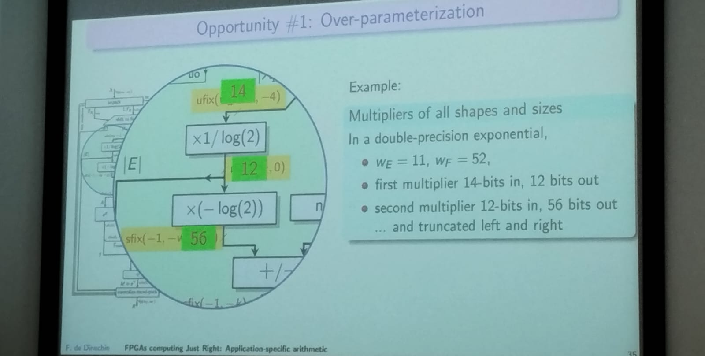

## Division by 3

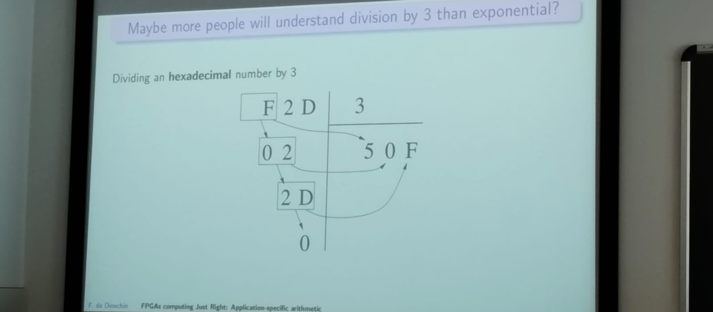

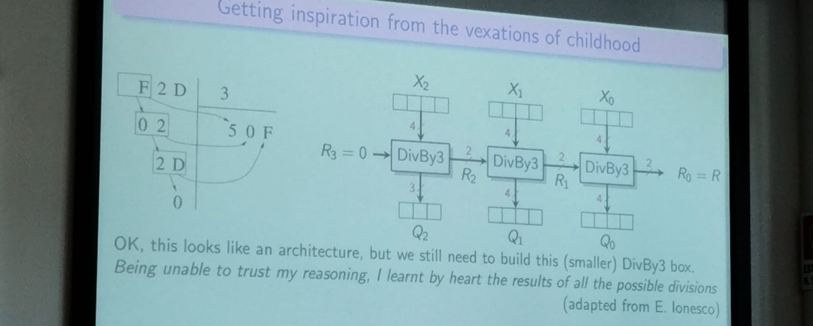

#### MonteCarlo simulation

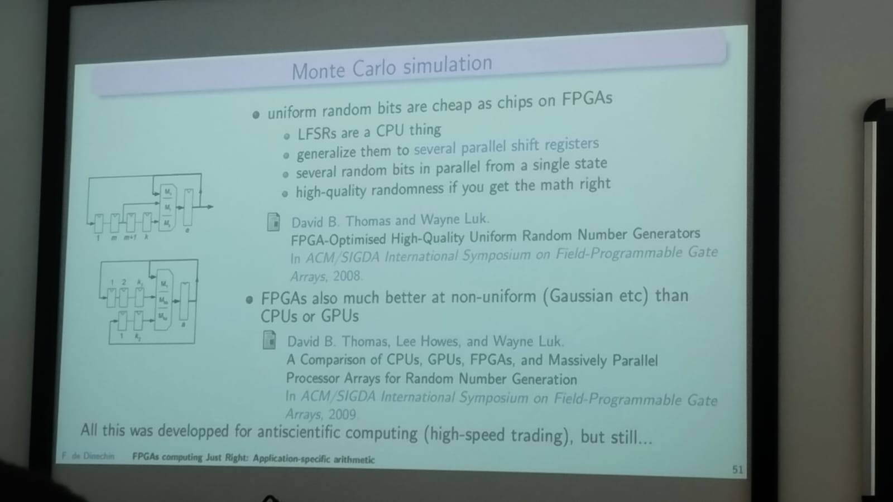

### Machine Learning and Artificial Intelligence

FloPoCo can to accelerate the process of calculation of complex operations in Artificial Intelligence applications

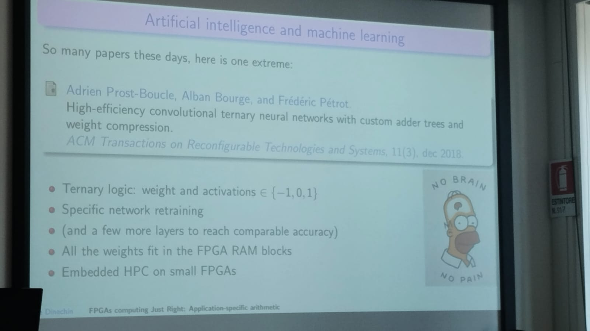

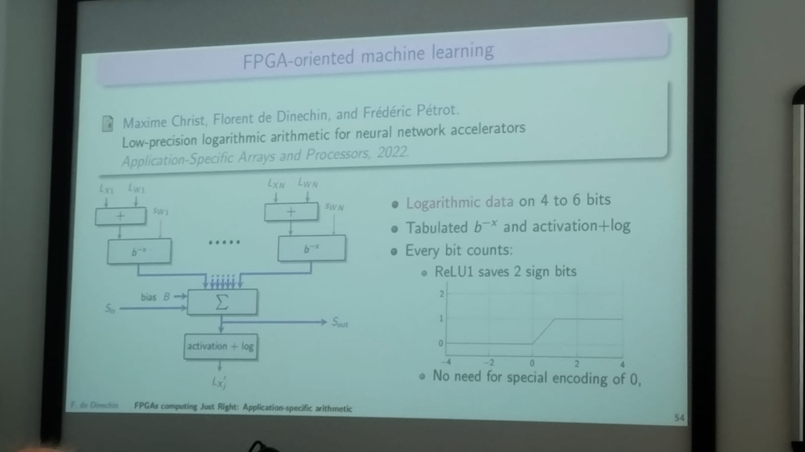

### Conclusions

- Each platform nrequires a different approach of arithmetics.

---

# HyperFPGA: Experimental Infrastructure for Reconfigurable Supercomputing

Author: Werner FLORIAN

email: werner_florian@live.com

## Result of his work as PhD student on ICTP

CPU, GPU or PFGA?

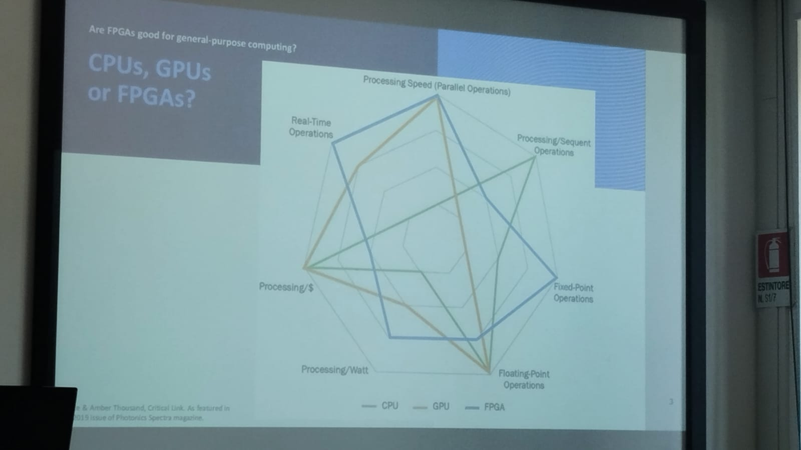

#### Distribution of the better tool for different dwards

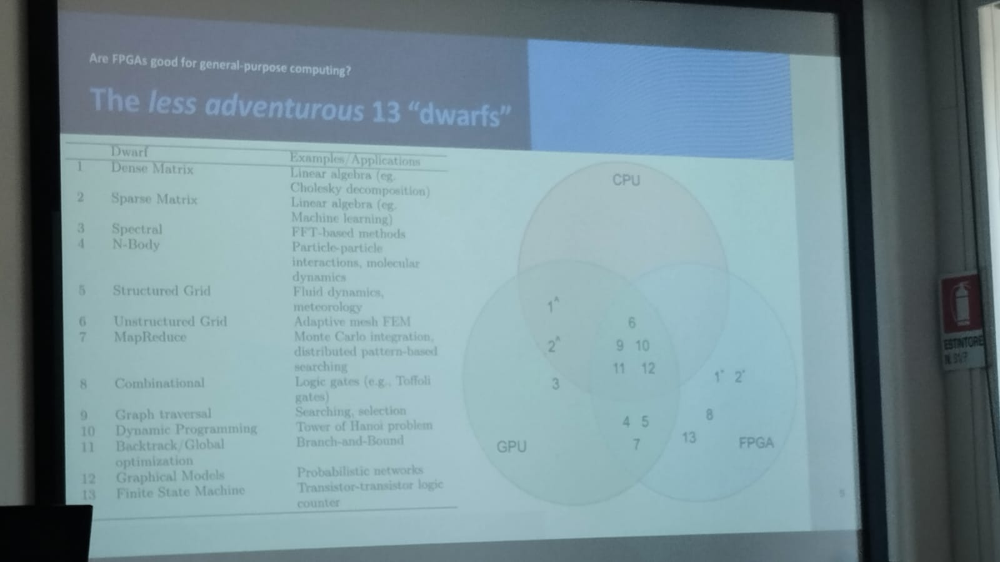

They builkd a reconfigurable cluster of FPGA that can be scaled to $nxn$ array of FPGA.

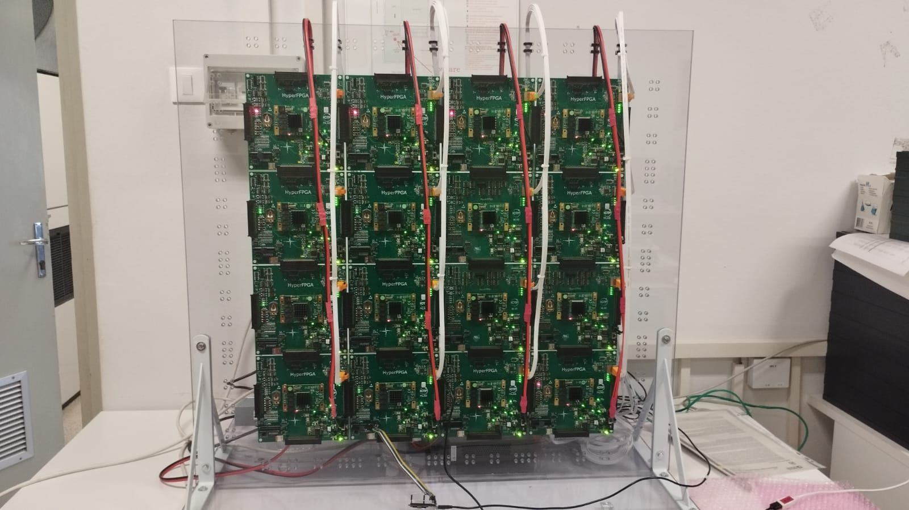

The works under the paradigm of **_Space computing_** and reconfigurable resources of the **FPGA**.

On scientific computing, they are requiring the building of more and more complex systems to allow to do haigh performance computation. the paradigm is base on have more power of computation based on **_Temporary computing_**, increase the frequency of the execution of the tasks, and it is quick expensive.

> Cluster of FPGAs can be use as communication infrastructures and for general purpose applications.

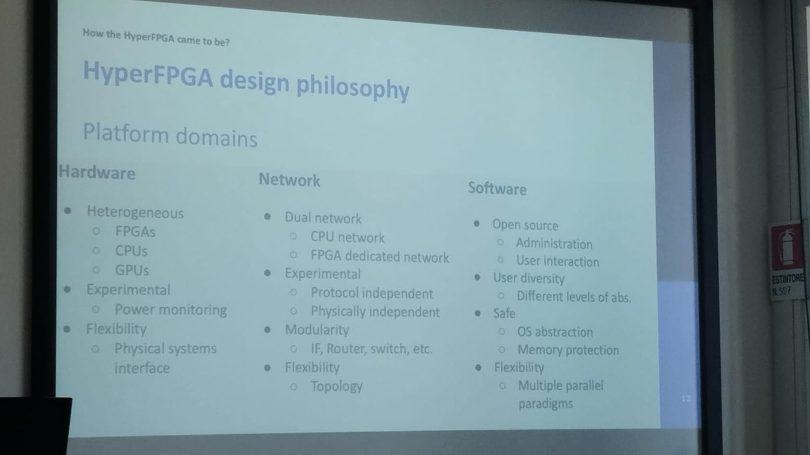

### The Hardware Design

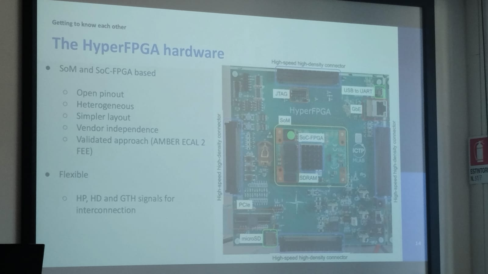

### Software stack

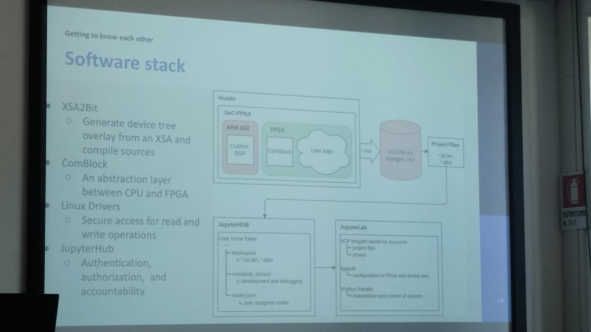

They use:

- XSA2Bit
  - Generate device tree overlay from an XSA and compile source
- ComBlock
  - An abstraction layer between CPU and FPGA
- Linux Driverrs
  - Secure access for read and write operations
- JupyterHub
  - Authentication, authorization, and accountability

### Cluster definition

1. Define the cluster with a JSON Strcuture
2. Create an iPython cluster

### Cluster creation and configuration

1. Create and connect to your iPython cluster
2. Load and apply the FPGA configuration, device tree overlay and Linux driver.

### Remote includes and accessing LKM

1. Instantiation of the files
2. Use remote nodes in python with `%px` definition

```python
%px import library
```

3. Load the comblock FIFO
4. Read the solutions from the solver
