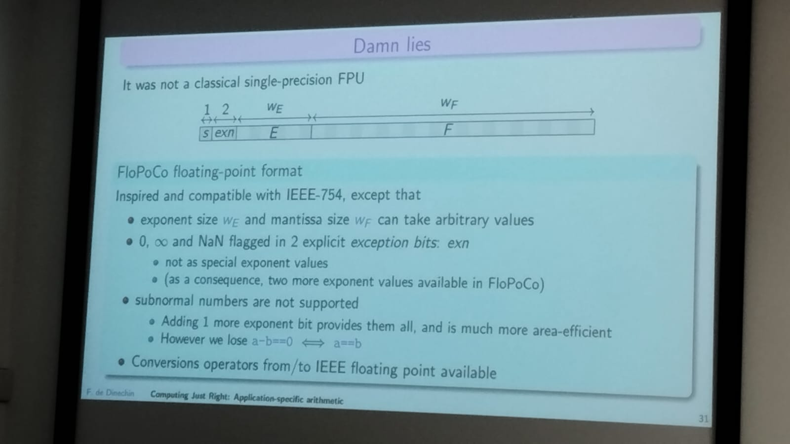
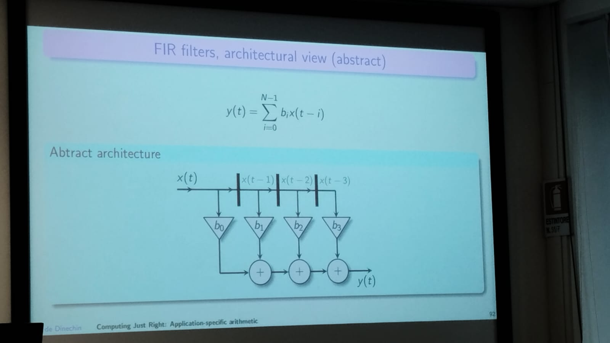
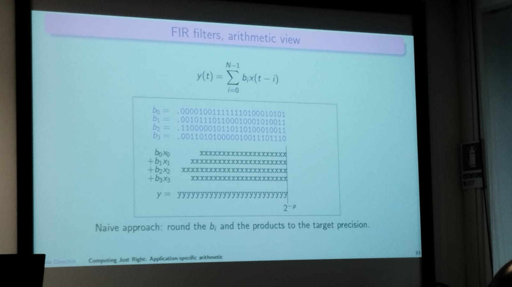
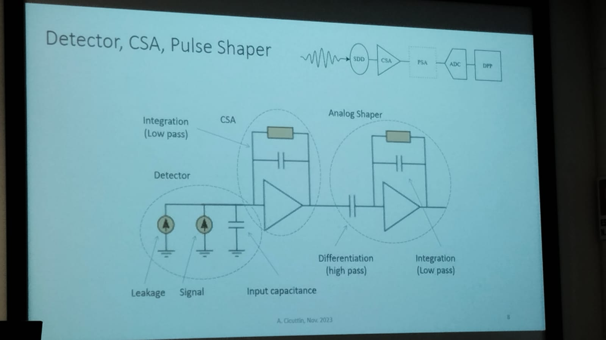

# Writing Scientific Papers

## Academic Writing Strategy for Impacted Journal

Author: Mamum Bin Ibne Reaz

### Journal Listing and Ranking

- ISI Listed Journal
  - Most reliable and authentic
  - Impact factor
  - Four quartile ranking (Q1, Q2, Q3, Q4)
  - Paid or without pay
  - Need certain time to be include
  - Can be withdraw from the list if failed to fullfill the criteria
  - Acceptable by every world-class university
- SCOPUS Listed Journal
  - Mostly not reliable
  - Pair or without pay
  - Not ranking
  - Some are acceptable but most are not accepted by world-class university
- SJR: Scientific Journal Ranking
  - Not accepted by any world-class university

### Type of articles

- Research paper
  - Long papers (more than 5 pages till 30)
  - Letter (1 to 3 pages)
  - Short communication (3 to 5 pages)
- Review papers

### Structure

- Title
- Author's name and affiliation
- Abstract
- Keywords
- Introduction
- Methodology
- Results and discussion
- Conclusions
- Acknowledgements
- Reference

---

# Title

- Should perfectly highlight your principal work
- Avoid ornamental words
- Realiable, scalable, high performance, robust, low complexity

## Authors

The authors and affiliation are important in the publication process, most of the referies review the background of the person and the research focus, how much publish in the topic.

## Abstract

It is a resume of all the paper in one short sentence, it needs to include:

- The state oof the proble
- Why it is an interesting problem
- What your solution achieves
- What follows from your solution

## Keywords

Words related to the woork ansd that makes more visible the paper in the searching platforms

## Introduction

The first paragraph should follow the inverted triangle principle, start with broad statement and become more detailed until finally identifying the specific problem. 

The purpose of the paragraph is to interest the reader in the paper.

The paragraph should end with the general problem addressed.

> One paper can be published if you show a contribution, the most important think is to show a contribution.

The last sentence of the first paragraph needs to introduce the second paragraph, you need to tell a one and connectec history.

In the last paragraph of your paper, you need to spicify your contribution, the question of the editor always is *Why should I publish your paper?*, *Which are your contributions*.

## Methodoloogy

Describe the methodology that you follow to develop the work

Avoid to describe well knowing algorithms as ANN, DWT.

## Results and Discussion

Should be clear, convincing, general and free to replicate.

Your introduction makes claims

The most important part of the discussionis comparison among various methods

In short papers, the discussion can not include the comparison, just your evidenced results and your observations

## Conclusions

Suggesting future research is not mandatory.

## Acknowledgements

It is just related with the grants that you obtained to do this study

## How to make responses

- Try to understand every single comments that has been given by the reviewers
- Though the comments are presented in descriptive way but try to figure out the number of questions from every paragraph of the description
- Once questions are figured out, give answer for every single question
- Show your extreme politeness in your responses even though the questions are not appropriate.

---

# Computing Just Right: Application-Specific Arithmetic with FloPoCo

## Example

### Implementation of FIR filter

## [Installation by Docker]()

* Install Docker on your computer.** **

  * On Debian/Ubuntu,apt install docker.io** **
    sudo usermod -aG docker ${USER}
  * For Windows, see** **[docker.com](https://www.docker.com/)
* Download the Dockerfile corresponding to the version you want:

  * [Dockerfile.2.5.0](http://flopoco.org/Docker/Dockerfile.2.5.0)
  * [Dockerfile.4.1.2](http://flopoco.org/Docker/Dockerfile.4.1.2)
  * [Dockerfile.plain.gitmaster](http://flopoco.org/Docker/Dockerfile.plain.gitmaster)
  * [Dockerfile.full.gitmaster](http://flopoco.org/Docker/Dockerfile.full.gitmaster)
* Place it in an otherwise empty directory
* then cd to this directory and type the following command:docker build -t flopoco -f Dockerfile.4.1.2 .

  (replace Dockerfile.4.1.2 with the one you selected)
* The following command sets up a convenient alias (in linux)alias flopoco="docker run --rm=true -v `pwd`:/flopoco_workspace flopoco"

  Now if you type for instance** **flopoco FPAdd we=8 wf=23
  you will obtain in the current directory a flopoco.vhdl file containing a single-precision floating-point adder.

### Operations

They can be found in the [Link](http://flopoco.org/operators_4.1.html).

---

# Digital Pulse Processing for X-ray Photon Detection and Energy Measurement

