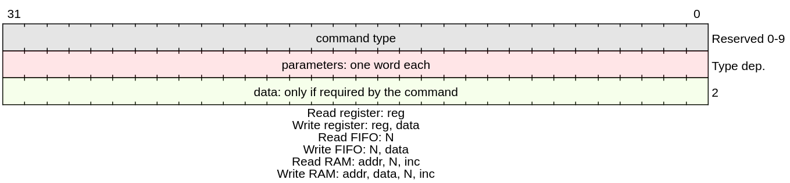
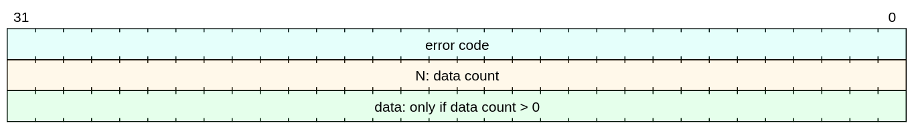

```
__/\\\________/\\\__/\\\\\\\\\\\\_____/\\\\____________/\\\\_____/\\\\\\\\\____        
 _\/\\\_______\/\\\_\/\\\////////\\\__\/\\\\\\________/\\\\\\___/\\\\\\\\\\\\\__       
  _\/\\\_______\/\\\_\/\\\______\//\\\_\/\\\//\\\____/\\\//\\\__/\\\/////////\\\_      
   _\/\\\_______\/\\\_\/\\\_______\/\\\_\/\\\\///\\\/\\\/_\/\\\_\/\\\_______\/\\\_     
    _\/\\\_______\/\\\_\/\\\_______\/\\\_\/\\\__\///\\\/___\/\\\_\/\\\\\\\\\\\\\\\_    
     _\/\\\_______\/\\\_\/\\\_______\/\\\_\/\\\____\///_____\/\\\_\/\\\/////////\\\_   
      _\//\\\______/\\\__\/\\\_______/\\\__\/\\\_____________\/\\\_\/\\\_______\/\\\_  
       __\///\\\\\\\\\/___\/\\\\\\\\\\\\/___\/\\\_____________\/\\\_\/\\\_______\/\\\_ 
        ____\/////////_____\////////////_____\///______________\///__\///________\///__
```

The UDMA is a remote control suite for interfacing a PC with custom logic in a SoC-FPGA. It was tested inside FreeRTOS on top of Lwip. But it should be able to run on any OS with little to no modifications (open an issue if you are interested on a specific port).

The communication with the FPGA is done through the [ComBlock](https://gitlab.com/rodrigomelo9/core-comblock/).

# Server

The server is provided as a C header. For the moment this file is Xilinx specific more vendors will be considered in future updates. This file provides one external function called:

```C
void process_command(u32 *recv_buf, int sd)
```

This function is interface agnostic. So in principle if the ```sd``` you provide supports the ```write``` function it should work. Currently it was only tested with Ethernet but Serial support will be considered for future updates.

# Client

The client is a python CLI based on Cmd2 library. To install the Python app you just need to clone the repository and open a terminal inside the repository root folder. Then type:

**For Linux**
```Bash
pip3 install .
```

or

```Bash
pip install .
```

**In Windows**
```bash
pip3 install --editable .
```

or

```bash
pip install --editable .
```

Depending on the environment variable name you gave to your python3-pip path. It is recommended to run this in a python-env to avoid crossed requirements between different packages or apps that might break the install.  

After the install you can execute the application by running ```udma_cli``` in any terminal. If the command cannot open terminal in the repo and run this command ```python3 src/cli/cli.py```.

The UDMA specific functions are defined inside the ```src/udma/udma.py``` file within the ```UDMA``` class.
Inside the ```cli.py``` file the command line interface built on ```cmd2``` is implemented.

If you want to integrate the functionality of UDMA into your projects all you need to do is include the ```udma.py``` in your Python project and instantiate the class.

## UDMA class

The class is in practice a TCP socket wrapper that incorporates a minimal protocol to execute UDMA specific commands.
When creating an instance of the class you need to provide the IP and port of the server.
Once the socket is created you just need to provide the required parameters depending on the command.

```Python
A class that manages the communication with an UDMA server
	Attributes
	-------
	ip: str
		the ip of the server to connect to in 'XXX.XXX.XXX.XXX' format
	port: int
		the port of the server
	s: socket
		the tcp connection to the server
	Methods
	-------
	set_ip(ip)
		set the ip
	set_port(port)
		set the port
	disconnect()
		close the socket
	get_ip()
		return the ip
	get_port()
		return the port
	connect()
		connect to the server with the specified ip and port
	close_server()
		send 'quit' to stop the server
	read_reg(reg)
		send the read register command and return the value
	write_reg(reg, data)
		write data to the register
	read_fifo(N)
		return N values from the FIFO
	write_fifo(N, data)
		write N values to the FIFO
	read_ram(addr, length, inc)
		return length values from the RAM starting from addr with an increment of inc
	write_ram( addr, length, inc, data)
		write length values to the RAM starting from addr with an increment of inc
	read_mem(addr, length, inc)
		return length values from memory starting from addr with an increment of inc
	write_mem(addr, length, inc, data)
		write length values to memory starting from addr with an increment of inc
	select_comblock()
		change the selected comblock on the FPGA side
	log()
		disable or enable serial logging
```


## Communication protocol

The communication between the PC and the board relies over Ethernet TCP/IP.
Using sockets you can connect to the board from any program.
To send comands you must follow the following structure:



The board will always answer with a response with the error flag of the command, data count and data if required.



## Command List for CLI

Here is a list of the available commands specific to the application. The cmd2 package includes more commands that help the user such as the ```help``` command which can be used to get more information regarding the application and its commands.

### Board communication

|||
|-|-|
|connect|Create the connect command to allow communication with the board via Ethernet|
|log|Starts serial logging to debug the transmission and processing of the messages|
|udma|Create the x_udma command to pass the UDMA instruction to the specified LRA |

>Note: UDMA function is not completely implemented and must not be used unless specified in the release notes

### Comblock Read

|||
|-|-|
|x_read_fifo|Create the x_read_fifo command to allow reading the FIFO of the Comblock|
|x_read_mem|Create the x_read_ram command to allow reading the RAM of the Comblock|
|x_read_ram|Create the x_read_ram command to allow reading the RAM of the Comblock|
|x_read_reg|Create the x_read_reg command to allow reading registers from the Comblock|

### Comblock Write

|||
|-|-|
|x_write_fifo|Create the x_write_fifo command to allow writing the FIFO of the Comblock|
|x_write_mem|Create the x_write_ram command to allow writing the RAM of the Comblock|
|x_write_ram|Create the x_write_ram command to allow writing the RAM of the Comblock|
|x_write_reg|Create the x_write_reg command to allow writing the registers of the Comblock|

# Usage

## Vitis software app

1. Copy the folder '''/src/udma_sw_app''' into '''Vitis/2021.2/data/embeddedsw/lib/sw_apps'''.
2. Open Vitis.
3. Create a new application project.
4. When prompted to select a template choose the **UDMA Server**.
5. Done.

## From Scratch

1. Create a new Vivado project (make sure a processor that can run a TCP stack is present and also one Comblock).
2. Add you custom logic and connect the control ports to the Comblock.
3. Generate the bitstream and export it.
4. Open your SDK or Vitis.
5. Create a FreeRTOS project based on the LWIP Echo.
6. Import 'udma.h' as a File System into the 'src' folder of the project.
7. Build the project, at this point no errors should show up.
8. Make a call to the process_message function inside 'echo.c' (or use the echo.c provided in the examples folder of this repo.).
9. Build again.
10. Load the bitstream onto the FPGA and program the ARM.
11. Go to the PC, open python and connect via the CLI. The default socket in the SoC is 192.168.1.10:7 if no DHCP is present.
12. Perform the read and write operations from the PC.

## Example

> There is an **example** and **test** files available on their respective folders.

### Follow these guide to setup the example

1. Create a new project in **Vivado**.
2. Open the project settings and add the **ComBlock** repository.
3. On the Tcl console navigate to the git repository. Use the ```cd``` command to change directory, ```dir``` to display the content of the current directory, and ```pwd``` to show the current directory.
4. Once you reached the ```udma``` directory, run the following script.
   ```source examples/udma_test_bd.tcl```
5. This will create the block design needed to run the ```udma``` test.
6. Generate the **bitsream**.
7. Export the Hardware including the **bitstream**.

Now that the hardware files were created we need the software.

1. Open **Vitis** or **SDK** from Vivado.
2. Create a project using the exported hardware.
3. Select **FreeRTOS** as the operating system.
4. Select the ```FreeRTOS Lwip Echo server``` project example.
5. Modify BSP settings.
   1. On **FreeRTOS** go to ```kernel_behavior``` tab and change ```total_heap_size``` to ```262144```.
   2. On **lwip211** go to ```lwip_memory_options``` tab and change ```mem_size``` to ```262144```.
   3. On **lwip211** go to ```pbuf_options``` tab and change ```pbuf_pool_size``` to ```2048```.
   4. On **lwip211** go to ```tcp_options``` tab and change ```tcp_mss``` to ```2048``` and ```tcp_snd_buf``` to ```16384```.
   5. Build the BSP and you are ready to continue.
6. Got to the project folder in the ```Project Explorer```, left click in the src folder and select Import.
7. In the ```General``` tab select ```File System```.
8. Browse your PC to the src folder of the repo.
9. Select the ```udma.h``` file and the [`examples/RVI_Lab/echo.c`](/examples/RVI_Lab/echo.c) file.

## Project implementation

1. Build the project.
2. Connect the ZedBoard programming USB cable.
3. Connect Ethernet cable and UART USB cable.
4. Configure the FPGA and program the CPU.
5. Run the Python CLI.
6. Enjoy!
